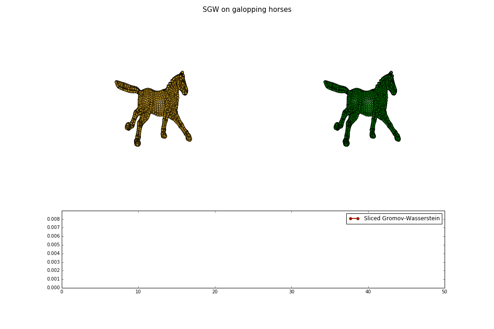

# SGW

Python3 implementation of the paper [Sliced Gromov-Wasserstein
](https://arxiv.org/abs/1905.10124) (NeurIPS 2019)

Sliced Gromov-Wasserstein is an Optimal Transport discrepancy between measures whose supports do not necessarily live in the same metric space. It is based on a closed form expression for 1D measures of the Gromov-Wasserstein distance (GW) [2] that allows a sliced version of GW akin to the Sliced Wasserstein distance. SGW can be applied for large scale applications (about 1s between two measures of 1 millions points each on standard GPU) and can be easily plugged into a deep learning architecture.

Feel free to ask if any question.

If you use this toolbox in your research and find it useful, please cite SGW using the following bibtex reference:

```
@incollection{vay2019sgw,
title = {Sliced Gromov-Wasserstein},
author = {{Vayer}, Titouan and {Flamary}, R{\'e}mi and {Tavenard}, Romain and
 {Chapel}, Laetitia and {Courty}, Nicolas},
booktitle = {Advances in Neural Information Processing Systems 32},
year = {2019}
}
```

### Prerequisites

* Numpy (>= 1.11)
* Matplotlib (>= 1.5)
* Pytorch (>= 1.1.0)
* For Optimal transport [Python Optimal Transport](https://pot.readthedocs.io/en/stable/) POT (>=0.5.1)

For examples with RISGW:
* Python (>= 3.6)
* [geoopt](https://github.com/geoopt/geoopt)

### What is included ?

* SGW function both in CPU and GPU (with Pytorch):




* Entropic Gromov-Wasserstein in Pytorch.

* Runtimes comparaison with Gromov-Wasserstein of [POT](https://github.com/rflamary/POT), Entropic Gromov-Wasserstein, e.g to calculate all runtimes (in expe_paper folder):

```
python3 runtime.py -p '../res' -ln 200 500 1000  -pr 10 20
```

To plot the results (in expe_paper folder):

```
python plot_runtimes.py -p '../res/runtime_2019_10_16_14_26_32/'
```

* Rotational Invariant SGW (RISGW) in Pytorch using geoopt. 

* Demo notebooks:
	- [sgw_example.ipynb](sgw_example.ipynb): SGW between random measures and 3D meashes
	- [risgw_example.ipynb](risgw_example.ipynb): RISGW between random measures and on spiral dataset

### What will be added ?
* Integration of SGW in the POT library [1]


### Authors

* [Titouan Vayer](https://github.com/tvayer)
* [Rémi Flamary](https://github.com/rflamary)
* [Romain Tavenard](https://github.com/rtavenar)
* [Laetitia Chapel](https://github.com/lchapel)
* [Nicolas Courty](https://github.com/ncourty)


## References

[1] Flamary Rémi and Courty Nicolas [POT Python Optimal Transport library](https://github.com/rflamary/POT)

[2] Facundo Mémoli [Gromov–Wasserstein Distances and the Metric Approach to Object Matching](https://media.adelaide.edu.au/acvt/Publications/2011/2011-Gromov%E2%80%93Wasserstein%20Distances%20and%20the%20Metric%20Approach%20to%20Object%20Matching.pdf)
